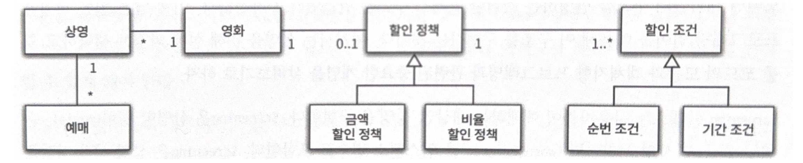
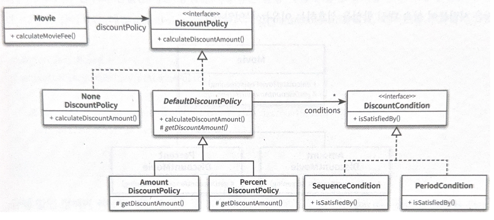

# 02. 객체지향 프로그래밍

**도메인 : 문제를 해결하기 위해 사용자가 프로그램을 사용하는 분야**

영화 예매 프로그램 예제를 만들어보며 객체지향 프로그래밍을 배워보는 챕터이다.
아래와 같은 요구사항을 구현하면서, 추상 클래스와 인터페이스를 활용한다.

---
할인 정책을 적용하는 부분에 초점을 둔 예제이다. **할인 조건에 부합하면, 특정 할인 정책을 적용해 가격을 할인**시켜야 한다. 영화별로 할인 조건들은 여러 개 이고, **할인 정책은 단 하나**만 존재한다.
> 와중에 특정 객체가 다른 클래스의 메서드를`호출한다` 보다는 메서드에 `메세지를 전송한다` 라는 표현이 맞다는 꿀팁도 전수한다.

> 글로만 보면 잘 이해가 안가니, 꼭 책의 코드와 함께 보는것을 추천한다.

- `Movie` 는 `calculateMovieFee()`를 이용해 영화 표 가격을 결정 - 이때 Movie 필드에 존재하는 `DiscountPolicy`를 활용한다.
- `DiscountPolicy`에서 `calculateDiscountAmount()`를 활용해서 할인 금액을 계산하게끔 함 - 책임 분배를 위해 `DiscountPolicy` 객체로 메세지 전송.
- 금액 할인 정책과 비율 할인 정책으로 나뉘므로, `DiscountPolicy`를 상속 혹은 구현해서 `AmountDiscountPolicy`, `PercentDiscountPolicy` 구현.
- `DiscountPolicy`에 할인 조건이 존재하고, 이는 할인 정책의 구분과는 별개이므로 모든 할인 정책이 보유해야 한다. 따라서 `DiscountPolicy`는 추상 클래스(구현 해야만 하는 메서드와, 그렇지 않은 메서드 필드 등 혼재)를 활용한다.
- 할인 정책이 없는 영화를 위해, `NoneDiscountPolicy`를 추가로 구현한다.
- `AmountDiscountPolicy`, `PercentDiscountPolicy` 에는 `getDiscountAmount()`가 존재하지만, `NoneDiscountPolicy`에는 존재하지 않음. 따라서 추상 클래스 상속을 하게 되는경우 구조상의 문제(`getDiscountAmount()`가 필요 없지만 구현해야 함)가 생긴다. 따라서 interface를 도입해서 해결한다.
- `NoneDiscountPolicy`에서는 할인값 연산 없이 0을 반환하는 구조.

#### 코드의 의존성과 실행시점의 의존성이 다를 수 있음 - 다형성
클래스 사이의 의존성과, 객체 사이의 의존성은 동일하지 않을 수 있다. 그리고 유연하고, 쉽게 재사용할 수 있으며, 확장 가능한 객체지향 설계가 가지는 특징은 코드의 의존성과 실행 시점의 의존성이 다르다는 것이다.

코드의 의존성과 실행 시점의 의존성이 다르면 다를수록 코드를 이해하기 어려워진다. 그러나 더욱 유연해지고 확장 가능해진다. 이와 같은 의존성의 양면성은 설계가 트레이드오프의 산물이라는 사실을 잘 보여준다.

설계가 유연해질수록 코드를 이해하고 디버깅하기는 점점 더 어려워진다. 반면 유연성을 억제할수록 가독성은 올라가지만 재사용성과 확장 가능성은 낮아진다. **항상 이 사이를 저울질하며 고민해보아야 한다.**

다형성을 통해 위 의존성을 컨트롤할 수 있다. 다형성을 구현해 코드를 작성한다면 해당 코드는 실행 시점에 바인딩한다. 이를 **지연 바인딩(*lazy binding*) ** 또는 **동적 바인딩(*dynamic binding*)**이라 한다. 그에 반해 전통적인 함수 호출과 같은 다형성을 사용하지 않은 코드들은 컴파일 시점에 실행될 함수 등을 결정한다. 이를 **초기 바인딩(*early binding*)** 혹은 **정적 바인딩(*static binding*)** 이라고 한다.
